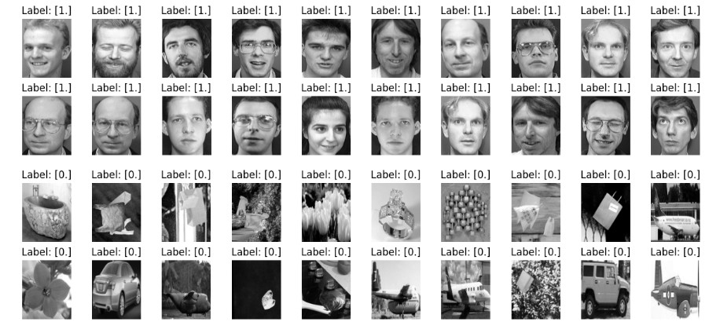
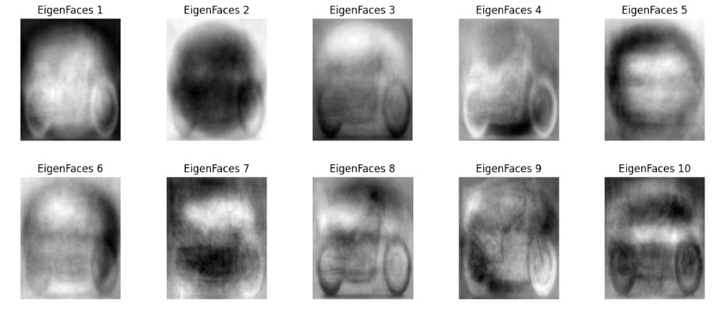
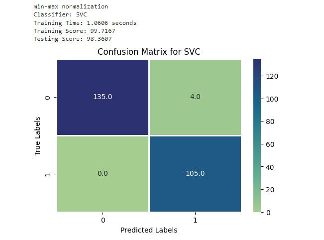
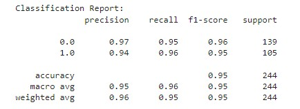

# Face and Non-Face Classification

## Table of Contents
1. Introduction
2. Getting Started
3. Usage
4. Contributing
5. License

## Introduction
This project is a machine learning model for face and non-face classification. It uses various techniques such as Principal Component Analysis (PCA), Linear Discriminant Analysis (LDA), and different classifiers to distinguish between images of faces and non-faces.

## PCA
Principal Component Analysis (PCA) is a dimensionality reduction technique that is used to extract important features from high-dimensional datasets. PCA works by identifying the principal components of the data, which are linear combinations of the original features that capture the most variation in the data

## LDA
Linear Discriminant Analysis (LDA) is a dimensionality reduction technique that is used to reduce the number of features in a dataset while maintaining the class separability. LDA is a supervised technique, meaning that it uses the class labels to perform the dimensionality reduction. LDA is a popular technique for dimensionality reduction in the field of pattern recognition and machine learning

## Dataset
+ The dataset for this project is the AT&T Face Database
- The dataset is open-source and can be downloaded from Kaggle.
* The dataset contains 400 images of 40 people, each person has 10 images.
+ The images are of size 92x112 pixels & in grayscale.
+ The Data Matrix is 400 x 10304 where each image is flattened in a vector and saved as a row in the Matrix
  
## Getting Started

### Prerequisites
Before you begin, ensure you have met the following requirements:
- You have installed the latest version of Python.
  ~~~ paython
  python 3.xx
  ~~~
- You have a basic understanding of machine learning concepts.
- You have the necessary Python libraries installed.
- These include `os`, `numpy`, `matplotlib`, `seaborn`, `PIL`, `sklearn`.

### Implementation 
#### **Libraries Used**
- NumPy
* Scikit-learn
+ Images

### Data Preprocessing

#### Face Images and Non-Face Images
1. Download a semi large dataset of non faces images (~550) sample.
2. Loaded non-face images from the specified file paths.
3. Convert images into gray scale
4. Resized each image to 92x112 pixels.
5. Flattened each image to a 1D array.
~~~ python
def load_images(path):
    images = []
    labels = []
    if path:
        for i, dir in enumerate(os.listdir(path)):
            for file in os.listdir(os.path.join(path, dir)):
                img = Image.open(os.path.join(path, dir, file)).convert('L')
                img = img.resize((92,112))
                images.append(np.array(img).flatten())
                labels.append(i+1)

    return np.array(images), np.array(labels).reshape(-1,1)
faces, labels = load_images('/content/drive/MyDrive/ColabNotebooks/ML_project_classification/datasets/faces')
non_faces, non_labels = load_images('/content/drive/MyDrive/ColabNotebooks/ML_project_classification/datasets/nonfaces')

~~~
#### Labels
1. Created binary labels (1 for faces, 0 for non-faces).
  ~~~ python
      faces_labels = np.ones((len(faces),1))
      non_faces_labels = np.zeros((len(non_faces),1))
  ~~~

#### Shuffle images within each class
why shuffling is basically used to be sure that you don't have bias when you splitting data into training and testing 
1. shuffle face images and their labels
2. shuffle non_faces images and their labels
~~~ python
def shuffle_data(data, labels):
    idx = np.arange(data.shape[0])
    np.random.shuffle(idx)
    return data[idx], labels[idx]
~~~

### Data Splitting
1. Split the data into training and testing sets using `split_data`.
2. Combined face and non-face data.
3. Re-shuffle the combined dataset
~~~ Python
def train_test_split(X, y, test_size=0.3, random_state = 42):
    # number of features
    m, n = X.shape
    # train size
    tsize = int(test_size * X.shape[0]) - 1    
    X_train, X_test, y_train, y_test = [], [], [], []
     ....
    # transform into np arrayes
    X_train, X_test, y_train, y_test = np.array(X_train), np.array(X_test), np.array(y_train), np.array(y_test)
    return X_train, X_test, y_train, y_test
~~~
### Display samples of training data and test data
~~~ Python
X_train, y_train=shuffle_data(X_train, y_train)
X_test, y_test = shuffle_data(X_test, y_test)

plot_data(X_train, y_train,10)
plot_data(X_test, y_test,10)
print(X_train.shape)
~~~

### Dimensionality Reduction: PCA
Applied PCA for dimensionality reduction.

Explored the variance explained by different components.

Transformed both training and testing data using the selected number of components.

Use the most efficient alpha value from the first part 0.85.

~~~ Python
def PCA(train_data,alpha=0.85):
    mean = np.mean(train_data, axis=0)
    centered_data = train_data - mean
    cov_matrix = np.dot(centered_data,centered_data.T)
    eig_values, eig_vectors = np.linalg.eigh(cov_matrix)
    idx = np.argsort(eig_values)[::-1]
    eig_values = eig_values[idx]
    eig_vectors = eig_vectors[:,idx]
    eig_vectors = np.dot(centered_data.T,eig_vectors)
    for i in range(eig_vectors.shape[1]):
        eig_vectors[:,i] = eig_vectors[:,i]/np.linalg.norm(eig_vectors[:,i])
    total = np.sum(eig_values)
    k = 0
    var = 0
    while var/total < alpha:
        var += eig_values[k]
        k += 1
    return eig_vectors[:,:k], mean

def project_data(data, eigenvectors, mean,):
    return np.dot(data - mean, eigenvectors)
~~~
#### Sample eigenfaces

### Dimensionality Reduction: LDA
Applied LDA for dimensionality reduction.

Use only one dominant eigenvector as we have only two classes.

Transformed both training and testing data using the selected number of components.
~~~ python
def LDA (train_data, train_labels, k=1):]
    mean1 = np.mean(train_data[train_labels.ravel() == 1], axis=0)
    mean0 = np.mean(train_data[train_labels.ravel() == 0], axis=0)

    Sw = np.dot((train_data[train_labels.ravel() == 1] - mean1).T, 
                (train_data[train_labels.ravel() == 1] - mean1)) 
            + np.dot((train_data[train_labels.ravel() == 0] - mean0).T, 
                        (train_data[train_labels.ravel() == 0] - mean0))
    Sb = np.dot((mean1 - mean0).reshape(-1,1), (mean1 - mean0).reshape(-1,1).T)

    eig_values, eig_vectors = np.linalg.eigh(np.dot(np.linalg.inv(Sw), Sb))
    eig_values = np.real( eig_values)
    eig_vectors = np.real( eig_vectors)
    idx = np.argsort(eig_values)[::-1]
    eig_values = eig_values[idx]
    eig_vectors = eig_vectors[:,idx]
    return eig_vectors[:,:k]
~~~

### Model Training and Evaluation
1) Use different models(Logistic regression, KNN and SVM) for training and evaluation

2) Trained the model using the transformed data.

3) Evaluated the model using accuracy.

sample confusion matrix and confusion report

## Usage
This project can be used to recognize faces and non-faces in images. The model is trained on a dataset of face and non-face images, and it can predict whether a new image is a face or not.

The code includes functions for loading and preprocessing the images, splitting the data into training and testing sets, applying PCA and LDA, and training and evaluating different classifiers.

## Contributors
- Abel Abebe Bzuayene
- Kidus Dagnaw Bellete
